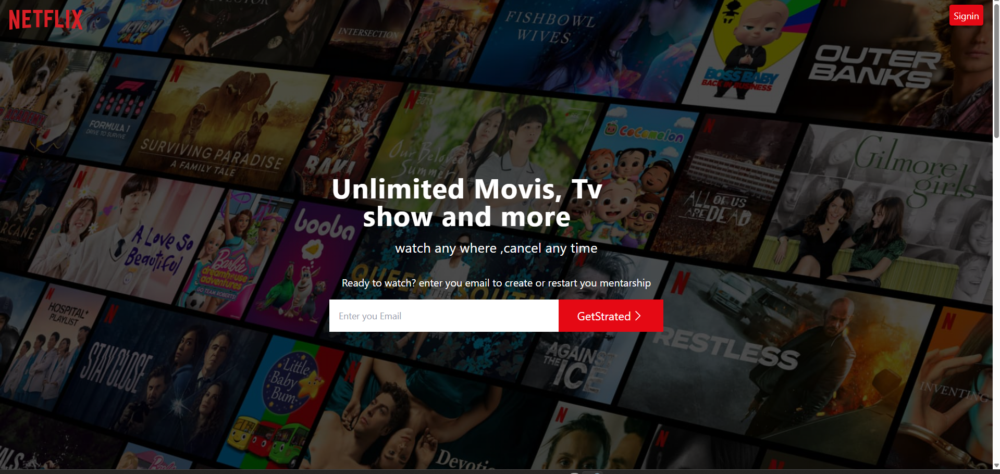

# 🎬 Netflix Clone (React + Vite)

A modern Netflix-inspired web application built using React, Vite, and Tailwind CSS. This project recreates a streaming platform UI with a clean structure and responsive design.

---

## 🚀 Features

* 🎥 Netflix-style homepage
* 📱 Responsive design
* ⚡ Fast development with Vite
* 🔐 Authentication UI (Login & Signup)
* 🎬 Movie browsing pages
* ♻️ Reusable components

---

## 🛠️ Tech Stack

* React.js
* Vite
* Tailwind CSS
* JavaScript (ES6+)

---

## 📂 Project Structure

```bash
src/
 ├── Atom/                # State management
 ├── Components/          # UI components
 │    ├── Browser/
 │    ├── Faqs/
 │    ├── Features/
 │    ├── Footer/
 │    └── Homehero.jsx
 │
 ├── Pages/               # Pages (Routing)
 │    ├── Home.jsx
 │    ├── Browser.jsx
 │    ├── List.jsx
 │    ├── LoginPage.jsx
 │    └── Signup.jsx
 │
 ├── assets/              # Images & static files
 ├── content/             # JSON data (faq, features, footer)
 ├── fire_Database/       # Firebase configuration
 │
 ├── App.jsx              # Main App component
 ├── main.jsx             # Entry point
 ├── constants.js         # Constants
 ├── request.js           # API requests
 └── index.css            # Global styles
```

---


```bash
git clone https://github.com/AbdisalamAshkir/netflix-clone-react.git
```

Go to the project folder:

```bash
cd netflix-clone-react
```

Install dependencies:

```bash
npm install
```

Run the project:

```bash
npm run dev
```

---


---

## 📸 Screenshots




---

## 💡 What I Learned

* Building scalable React applications
* Creating reusable UI components
* Structuring large projects professionally
* Using Vite for fast development

---

## 🎯 Future Improvements

* 🔗 Connect real Movie API (TMDB)
* 🔐 Implement full authentication
* 🎬 Add video streaming
* 🎨 Improve UI animations

---


